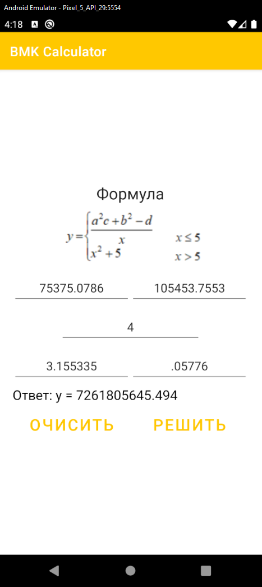

# BMK02_Calculator
## Разработка программ для мобильных устройств

1) Программа с использованием 2-х разметок: горизонтальной и вертикальной:  
- вертикальная разметка состоит из линейной вертикальной разметки с вложенной горизонтальной разметкой;  
- горизонтальная разметка состоит из табличной разметки  
2) Программа восстанавливает данные при переворачивании экрана  
 Лабораторная работа №2
 Вариант - 1

 Дерево компонентов для вертикальной разметки 

 Дерево компонентов для горизонтальной разметки 

 Интерфейс приложения 

 Расчёт значения по алгоритму в вертикальной ориентации экрана <= 5 

 Интерфейс приложения в горизонтальной ориентации экрана 
